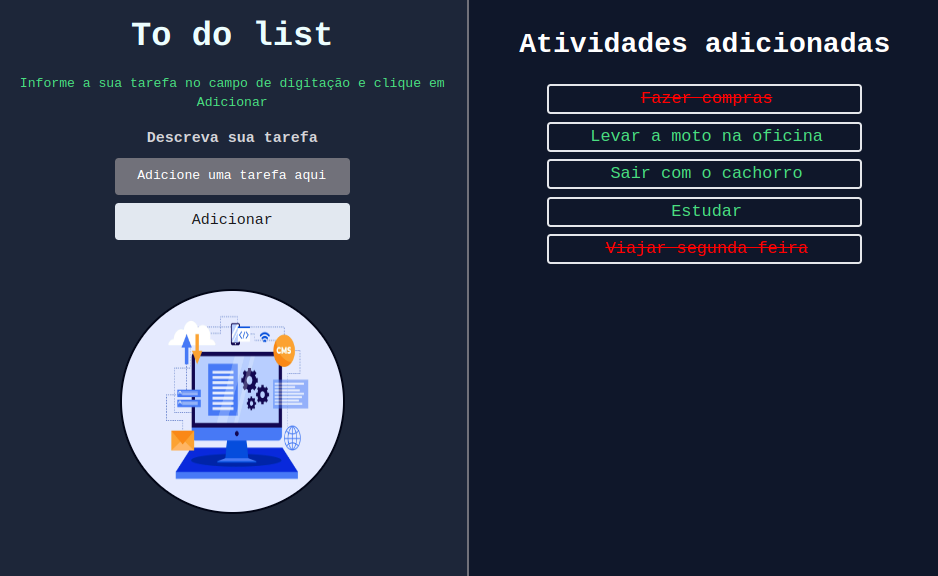
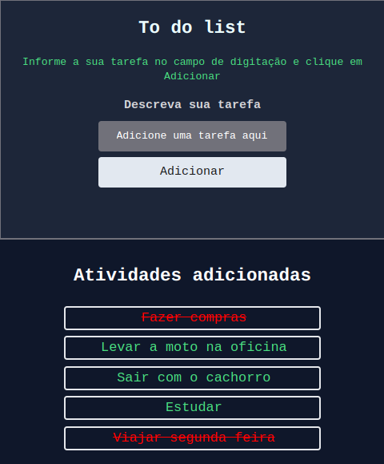

# Tasks Lists

Com intuito em fazer o uso do hook UseReducer, desenvolvi esta simples aplicação na qual adiciona uma lista de tarefas onde poderão ser marcadas como conclúidas para um auxilio pessoal do usuário.


---
# Desenvolvimento

[react](https://react.dev/) <br/>
[tailwindcss](https://tailwindcss.com/) <br/>
[typescript](https://www.typescriptlang.org/) <br/>

---

# Como usar

Para testar o software será necessário baixar o repositório em sua máquina e utilizar o comando ```npm install``` + ```npm run dev```

---

# Layout





--- 

# Contribuidores

